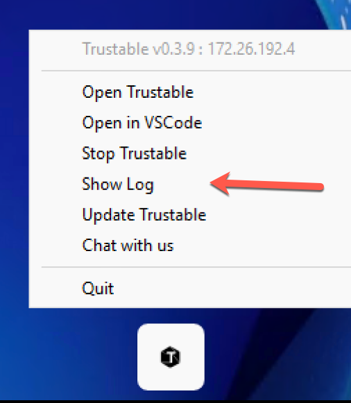
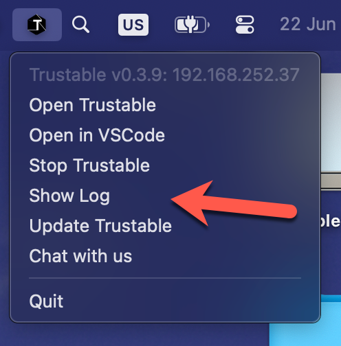

# Trustable Support & FAQ

This page answers common support questions for Trustable: how to get help, view logs, start, update, and uninstall the application.

## What is Trustable?

Trustable is a private vibe-coding platform inspired by [Lovable.dev](https://lovable.dev).

It provides cloud infrastructure for building applications with AI-assisted development while keeping your data and code under your control.

## How do I report a bug or request a feature?

Open an issue in the support repository:

https://github.com/trustable-ai/.github/issues

When reporting a bug, include:

- A clear description of the problem
- Your operating system and version
- Steps to reproduce the issue
- Relevant logs; see [How do I display logs?](#how-do-i-display-logs)

## Does Trustable use cloud models?

Trustable is designed to work well with private AI, but it does not restrict you to private AI only.

By default, Trustable offers three model options:

- **Trustable Cloud**: currently powered by [Regolo.AI](https://regolo.ai), with access to a wide range of open models. Until September, AI traffic is offered free courtesy of Nuvolaris. Fair-use policy applies.
- **Ollama Cloud**: use your own Ollama Cloud account.
- **Your own LLM**: run a model on suitable GPU hardware, as long as it exposes an OpenAI-compatible HTTP endpoint reachable without authentication.

If you use Trustable Cloud, you can redeem one free published app by emailing redeem@nuvolaris.io.

## How do I display logs?

The way to display logs depends on your operating system.

### Windows

1. Open the tray bar.
2. Click the black hexagon icon with a **T**.
3. Select **Show Log**.



A browser window opens and continuously displays the logs.

### macOS

1. Open the menu bar.
2. Click the black hexagon icon with a **T**.
3. Select **Show Log**.



A browser window opens and continuously displays the logs.

### Linux

Open a terminal, or connect by SSH, and run:

```sh
trustable-log
```

The command displays logs continuously. Press **Ctrl-C** to stop it.

## How do I start Trustable?

### Windows

From the tray bar, select **Start Trustable**.

If Trustable is already running, select **Open Trustable**.

### macOS

From the menu bar, select **Start Trustable**.

If Trustable is already running, select **Open Trustable**.

### Linux

Linux does not provide a tray bar or menu bar for Trustable. It runs mostly as a collection of web services.

If Trustable is running on your local machine, open:

http://trustable.miniops.me

If Trustable is running on a VPS, connect with an SSH tunnel:

```sh
ssh -L 8080:127.0.0.1:80 <user>@<server>
```

Then open:

http://trustable.miniops.me:8080

## How do I update Trustable?

### Windows

From the tray bar, select **Update Trustable**.

### macOS

From the menu bar, select **Update Trustable**.

### Linux

Run:

```sh
trustable-update
```

## How do I uninstall Trustable?

### Windows

1. Search for **Installed Apps** and open it.
2. Find **Trustable**.
3. Select **Uninstall**.

For safety, the installer does not remove the distro or your data.

To remove the distro, list the available distros:

```powershell
wsl -l
```

Then unregister the Trustable distro:

```powershell
wsl --unregister Trustable-<version>
```

To remove local data, delete:

```text
%LOCALAPPDATA%\Trustable
```

### macOS

1. Open the **Applications** folder.
2. Move **Trustable.app** to the Trash.
3. Empty the Trash.

To remove local data, delete:

```text
~/Library/Application Support/Trustable
```

### Linux

To remove the program only, run:

```sh
apt uninstall trustable
```

Then remove Trustable data:

```sh
rm -rf /var/lib/rancher/k3s /home/trustable
```

Alternatively, remove both the program and its data with:

```sh
apt purge trustable
```

# How can I make a template compatible with Trustable?

To use trustable the absolute minimum is a  need a folder including two folders:

- `web` for the static frontend
- `packages` for the functions

This is the absolute minimum, with `web` only including static html and packages stor

Also you need a `package.json` including
